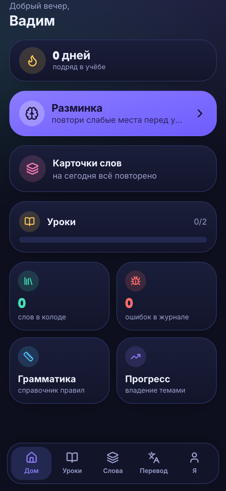
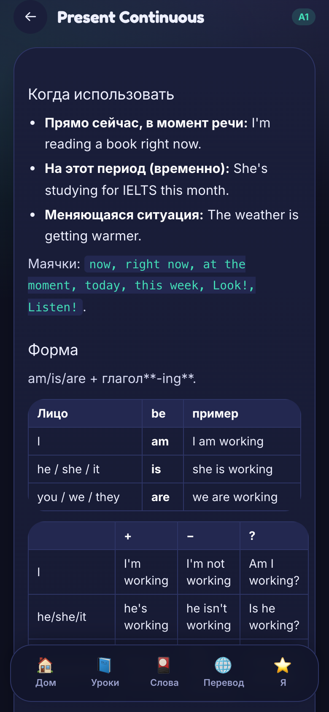
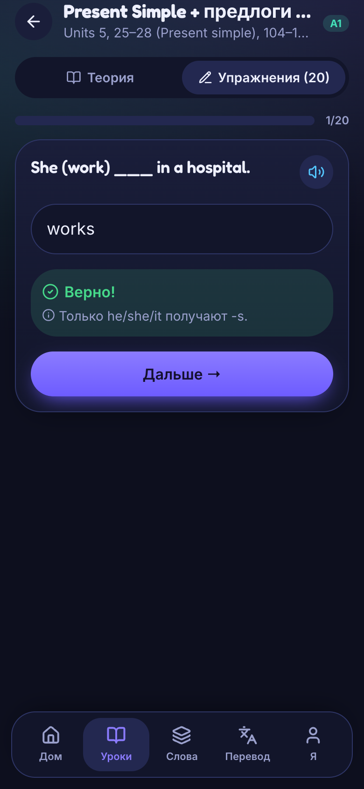
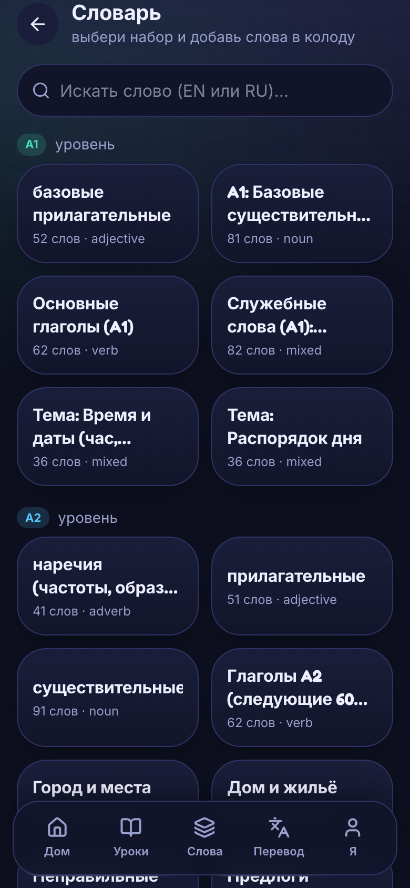
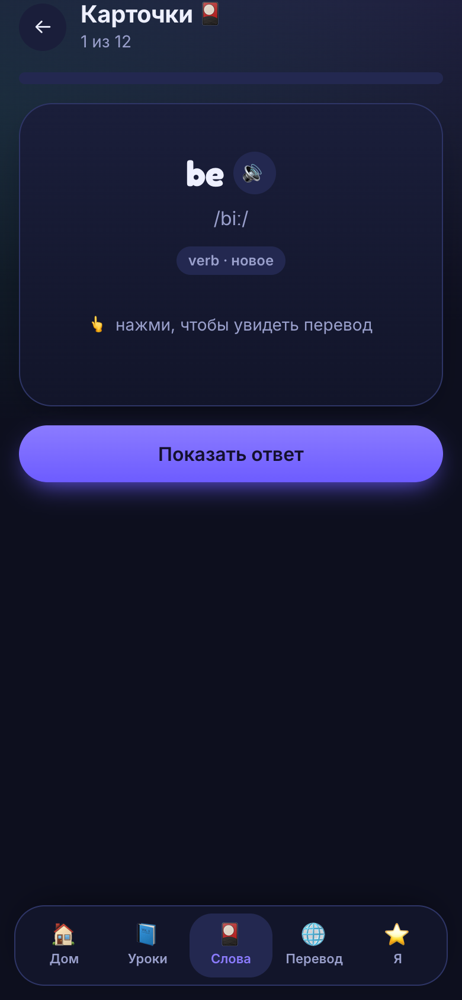

<div align="center">


# English Trainer

**A self-hosted, mobile-first PWA for learning English — from A1 to IELTS.**

Grammar lessons · spaced-repetition vocabulary · graded reading · illustrated picture books · listening · AI writing & speaking feedback · pronunciation · daily guided sessions. No subscriptions, no ads, your data on your own server.

<sub>Built for two learners (and their cat). MIT-licensed — deploy your own.</sub>

</div>

---

## ✨ Features

**Four skills, one app:**

- 📖 **Grammar** — 45+ structured lessons (A1→B2) with theory, examples, videos, and auto-checked exercises (with hints). Plus a full reference: all 12 tenses cheat-sheet, irregulars, everyday words, body parts.
- 📚 **Reading** — 50+ graded stories & fairy tales (A1–B1), each fully illustrated, with tap-to-translate, audio narration, glossary→deck, and comprehension questions. Plus flippable **picture books** (page-by-page reader).
- 🎧 **Listening** — TTS dictation drills (A1–B1): hear a phrase, type what you heard.
- ✍️ **Writing & 🗣️ Speaking** — answer prompts by text or **voice**, get **AI feedback** calibrated to your level (corrections explained in Russian, band estimate). IELTS Task 1/2 & Speaking Part 1/2/3.
- 🔊 **Pronunciation** — minimal-pair training (ship/sheep) with an ear-training quiz.

**The engine that keeps you going:**

- 🗓️ **Daily session** — one tap builds today's plan: warm-up → due words → next lesson → listening/reading.
- 🧠 **SM-2 spaced repetition** for 3000+ words (49 themed sets) + words you save from any text.
- 🗺️ **Study plan** A1→IELTS with pacing stats, 🔥 streaks, XP, levels and badges.
- 🐛 **Error log**, ✅ progress tracker, 🔁 warm-ups, 🌐 context-aware translator.
- 🔔 **Push reminders** (incl. a "you've been away" re-engagement nudge), 👤 admin panel with per-user stats.

**Crafted details:**

- 🎙️ **ElevenLabs** TTS — a natural, measured voice, server-cached so each phrase is generated only once.
- 🖼️ All artwork as **WebP**, lazy-loaded; skeleton loaders & smooth transitions (no layout jank).
- 📴 Installable PWA, offline-friendly, eternal login that survives deploys.

## 📱 Screenshots

| Home | Grammar | Exercise | Vocabulary | Review |
|---|---|---|---|---|
|  |  |  |  |  |

## 📚 Documentation

[Features](docs/Features.md) · [Architecture](docs/Architecture.md) · [Content Authoring](docs/Content-Authoring.md) · [Deployment](docs/Deployment.md) · [Roadmap](docs/Roadmap.md) — also on the [Wiki](https://github.com/dripips/english-trainer/wiki).

## 🧱 Tech stack

- **Frontend:** Vite + React 19 + TypeScript + Tailwind v4, PWA (`vite-plugin-pwa`, injectManifest).
- **Backend:** Fastify 5 on Node 24 with the built-in `node:sqlite` (zero external DB).
- **Content:** Markdown lessons (gray-matter front-matter) + JSON vocab/books — edit files, no code.
- **AI (all optional):** any OpenAI-compatible chat API for translation & writing/speaking feedback; ElevenLabs for speech; Gemini ("Nano Banana") for generating story art.

## 📁 Project structure

```
content/            # all learning content (no code needed to add more)
  lessons/*.md      #   grammar lessons, reading texts (kind: reading), listening drills
  books/*.json      #   illustrated picture books (+ AGENT_PROMPT.md to generate new ones)
  grammar/*.md      #   grammar reference cards
  vocab/*.json      #   themed vocabulary sets
server/src/         # Fastify API, SQLite, SRS (SM-2), push scheduler, TTS proxy
web/src/            # React PWA (screens, components, lib)
  public/reading/   #   story cover art (webp)
  public/books/     #   picture-book page art (webp)
```

## 🚀 Getting started

**Prerequisites:** Node 24+ (for `node:sqlite`).

```bash
git clone https://github.com/dripips/english-trainer.git
cd english-trainer
npm install                      # installs web + server workspaces
cp .env.example server/.env      # then fill it in (see below); chmod 600 server/.env

npm run build:web                # build the PWA
npm start                        # start the Fastify server (serves API + built PWA)
```

Dev mode: `npm run dev` (Vite dev server + API with proxy).

### Configuration

Everything is environment variables — see [`.env.example`](.env.example). The app runs with **only** `AUTH_SECRET`, `COOKIE_SECRET` and `SEED_USERS` set: translation falls back to a free API, and TTS to the browser voice. Add `LLM_TRANSLATE_*` for context-aware translation + AI feedback, `ELEVENLABS_*` for natural speech, and `VAPID_*` for push reminders.

### Deployment

Any Node 24 host works. The reference setup is `git pull` → `npm run build:web` → `systemctl restart` behind a reverse proxy with HTTPS. The SQLite file and TTS cache live under `server/data/` — back it up; it survives deploys.

## ✏️ Adding content

No build step for content — drop a file in `content/` and restart the server:

- **Grammar lesson / reading text / listening drill:** a Markdown file in `content/lessons/` with YAML front-matter (`id`, `level`, `exercises`, optional `reading`, `kind: reading`). Copy any existing lesson as a template.
- **Vocabulary set:** a JSON file in `content/vocab/`.
- **Illustrated picture book:** a JSON file in `content/books/` + page art. A ready-made agent prompt writes the story *and generates the illustrations* end-to-end — see [`content/books/AGENT_PROMPT.md`](content/books/AGENT_PROMPT.md).

## 📜 License

[MIT](LICENSE).
